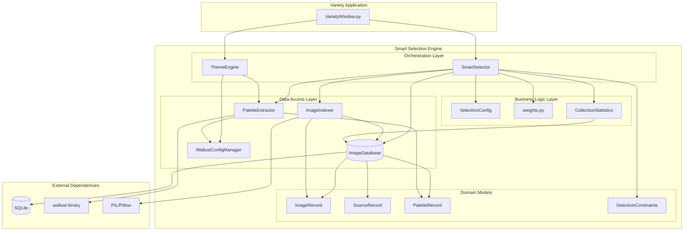

# Architecture Review - Smart Selection Engine

**Review Date:** 2025-12-30
**Reviewer:** Architecture Review (Opus 4.5)
**Component:** `variety/smart_selection/`
**Version:** Phase 4 Final

---

## Executive Summary

The Smart Selection Engine is a well-architected modular subsystem that provides weighted wallpaper selection with recency tracking, source rotation, favorites boost, and color palette awareness. The architecture demonstrates strong separation of concerns, appropriate use of design patterns, and careful attention to thread safety. Key strengths include the clean layered architecture and comprehensive batch operations for performance. The main concerns are moderate coupling between `SmartSelector` and multiple subsystems, reliance on external process (wallust) for palette extraction, and potential memory pressure when loading all candidates for large collections.

---

## Architecture Strengths

### 1. Clean Layered Architecture

The module follows a well-defined layered structure with clear responsibilities:

```
+------------------+
|    Selector      |  <- Orchestration layer (SmartSelector)
+------------------+
         |
+--------+--------+--------+--------+
|        |        |        |        |
| Config | Weights| Stats  | Theme  |  <- Business logic layer
+--------+--------+--------+--------+
         |
+--------+--------+--------+
|        |        |        |
| Models | Indexer| Palette|  <- Data access/extraction layer
+--------+--------+--------+
         |
+------------------+
|    Database      |  <- Persistence layer (ImageDatabase)
+------------------+
```

Each layer has a single responsibility:
- **Models** (`models.py`): Pure data structures with no behavior
- **Database** (`database.py`): CRUD operations and query methods
- **Config** (`config.py`): Configuration data class with serialization
- **Weights** (`weights.py`): Pure functions for weight calculation
- **Palette** (`palette.py`): External tool integration and color math
- **Statistics** (`statistics.py`): Cached aggregate queries
- **Theming** (`theming.py`): Template processing engine
- **Selector** (`selector.py`): High-level orchestration

### 2. Appropriate Design Pattern Usage

| Pattern | Location | Implementation Quality |
|---------|----------|----------------------|
| **Repository** | `ImageDatabase` | Excellent - clean CRUD abstraction over SQLite |
| **Data Transfer Object** | `ImageRecord`, `PaletteRecord`, etc. | Excellent - immutable dataclasses |
| **Strategy** | `recency_factor()` decay modes | Good - decay strategies via parameter |
| **Facade** | `SmartSelector` | Good - unified API for complex subsystems |
| **Cache-Aside** | `CollectionStatistics` | Excellent - thread-safe with invalidation |
| **Template Method** | `ThemeEngine.apply()` | Good - debounced vs immediate application |
| **Factory** | `create_palette_record()` | Adequate - simple factory function |
| **Adapter** | `parse_wallust_json()` | Good - adapts external format to internal |
| **Singleton** | `get_config_manager()` | Good - thread-safe global instance |

### 3. Thread Safety Implementation

Thread safety is consistently implemented across the codebase:

```python
# Example from database.py - RLock for reentrant locking
class ImageDatabase:
    def __init__(self, db_path: str):
        self._lock = threading.RLock()

    def get_image(self, filepath: str) -> Optional[ImageRecord]:
        with self._lock:
            cursor = self.conn.cursor()
            # ... operations
```

- **ImageDatabase**: Uses `RLock` for all operations, enabling nested calls
- **CollectionStatistics**: Uses `Lock` with proper cache invalidation
- **ThemeEngine**: Uses `Lock` for template cache and debouncing
- **WallustConfigManager**: Uses module-level lock for singleton

### 4. Batch Operations for Performance

The architecture includes comprehensive batch operations that avoid N+1 query problems:

```python
# database.py - Batch operations
def batch_upsert_images(self, records: List[ImageRecord])
def batch_upsert_sources(self, records: List[SourceRecord])
def batch_delete_images(self, filepaths: List[str])
def get_indexed_mtime_map(self, folder_prefix: str) -> Dict[str, int]
def get_sources_by_ids(self, source_ids: List[str]) -> Dict[str, SourceRecord]
def get_palettes_by_filepaths(self, filepaths: List[str]) -> Dict[str, PaletteRecord]
```

These are correctly utilized in `selector.py` and `indexer.py`:

```python
# selector.py - Batch loading before iteration
source_ids = list(set(img.source_id for img in candidates if img.source_id))
sources = self.db.get_sources_by_ids(source_ids) if source_ids else {}
palettes = self.db.get_palettes_by_filepaths(filepaths)
```

### 5. Schema Migration System

The database includes a forward-compatible migration system:

```python
class ImageDatabase:
    SCHEMA_VERSION = 2

    def _run_migrations(self):
        migrations = {
            2: self._migrate_v1_to_v2,
        }
        for target_version in range(current_version + 1, self.SCHEMA_VERSION + 1):
            migrations[target_version]()
```

This allows the schema to evolve without breaking existing installations.

### 6. Context Manager Support

Resource management uses context managers throughout:

```python
# Proper resource cleanup
with SmartSelector(db_path, config) as selector:
    selected = selector.select_images(5)

# Also in database
with self._lock:
    cursor = self.conn.cursor()
```

### 7. Comprehensive Documentation

All modules have thorough docstrings with:
- Module-level purpose documentation
- Class-level responsibility documentation
- Method-level parameter and return documentation
- Thread-safety notes where applicable
- Performance characteristics documented (e.g., O(1) lookups)

---

## Architecture Concerns

### 1. SmartSelector Has Multiple Responsibilities (Moderate Concern)

`SmartSelector` at 726 lines acts as a "God class" orchestrating too many concerns:

**Current Responsibilities:**
- Image selection with weighted random
- Recording shown images
- Statistics management
- Palette extraction orchestration
- Database maintenance (vacuum, verify, cleanup)
- Index rebuilding
- Preview candidate generation
- Time-based temperature calculation

**Impact:** Violates Single Responsibility Principle. Changes to any subsystem require modifying this file.

**Recommendation:** Extract specialized managers:
```python
# Proposed refactoring
class SelectionManager:       # Core weighted selection
class MaintenanceManager:     # vacuum, verify, cleanup, rebuild
class PreviewManager:         # preview candidates, weight visualization
class TimeAwareSelector:      # time-based temperature/period logic
```

### 2. External Process Dependency for Palette Extraction (Moderate Concern)

The palette extraction relies on shelling out to `wallust`:

```python
# palette.py
result = subprocess.run(
    [self.wallust_path, 'run', '-s', '-T', '-q', '-w',
     '--backend', 'fastresize', image_path],
    capture_output=True,
    timeout=30,
)
```

**Issues:**
- 30-second timeout per image could block batch operations
- Cache file discovery uses timestamp matching (documented race condition)
- No fallback if wallust is unavailable
- Process spawning overhead for each image

**Impact:** Performance bottleneck for batch palette extraction; fragile integration.

**Recommendation:**
1. Consider Python-based color extraction (e.g., `colorthief`, `sklearn.cluster.KMeans`)
2. Implement async/parallel palette extraction for batches
3. Add configurable concurrency limit

### 3. Memory Pressure with Large Collections (Moderate Concern)

The selection algorithm loads all candidates into memory:

```python
# selector.py
def _get_candidates(self, constraints):
    candidates = self.db.get_all_images()  # Loads ALL images
    # Then filters in Python...
```

For collections of 10,000+ images, this creates:
- ~10-20MB per query (ImageRecord objects)
- Full table scan on every selection
- Filtering happens in Python, not SQL

**Impact:** Memory spikes and slower selection for large collections.

**Recommendation:**
1. Push constraint filtering to SQL queries
2. Implement cursor-based pagination for candidate loading
3. Add database-side random sampling for initial candidate pool

### 4. Coupling Between Selector and Database Schema (Minor Concern)

`SmartSelector` directly accesses `self.db` and uses database-specific methods:

```python
# Direct database access leaking through selector
self.db.get_image(filepath)
self.db.record_image_shown(filepath)
self.db.get_sources_by_ids(source_ids)
```

**Impact:** Changes to database schema require changes to selector.

**Recommendation:** Consider a repository pattern that abstracts the database interface more completely.

### 5. Configuration Scattered Across Options and SelectionConfig (Minor Concern)

Configuration comes from two sources:
1. `SelectionConfig` dataclass for runtime parameters
2. `VarietyWindow.options` attributes for persistence

```python
# VarietyWindow.py
config = SelectionConfig(
    image_cooldown_days=getattr(self.options, 'smart_image_cooldown_days', 7.0),
    source_cooldown_days=getattr(self.options, 'smart_source_cooldown_days', 1.0),
    # ... more getattr calls
)
```

**Impact:** Configuration management is split between two locations.

**Recommendation:** Use a single configuration source with serialization to/from variety.conf.

### 6. No Interface Abstractions (Minor Concern)

The module lacks formal interface definitions (Protocol classes or ABCs):

```python
# Current: Concrete class coupling
class SmartSelector:
    def __init__(self, db_path: str, config: SelectionConfig, ...):
        self.db = ImageDatabase(db_path)  # Concrete class
```

**Impact:** Testing requires actual database instances; hard to mock.

**Recommendation:**
```python
# Proposed: Protocol-based abstraction
class ImageRepositoryProtocol(Protocol):
    def get_image(self, filepath: str) -> Optional[ImageRecord]: ...
    def get_all_images(self) -> List[ImageRecord]: ...
    # ...
```

### 7. ThemeEngine TOML Fallback Parser (Minor Concern)

The fallback TOML parser is limited and fragile:

```python
# theming.py - Regex-based TOML parsing
pattern_template_first = re.compile(
    r'^(\w+)\s*=\s*\{\s*'
    r'template\s*=\s*"([^"]+)"\s*,\s*'
    r'target\s*=\s*"([^"]+)"\s*\}'
)
```

**Impact:** May fail on valid TOML syntax variations.

**Recommendation:** Require `tomli` as a dependency for Python <3.11, or document the limitation clearly.

---

## Dependency Analysis

### Module Dependency Graph

```
                    +----------------+
                    | VarietyWindow  |
                    +-------+--------+
                            |
                            v
+----------+        +-------+--------+        +---------+
|  config  | <----- | SmartSelector  | -----> | theming |
+----------+        +-------+--------+        +---------+
                            |
         +------------------+------------------+
         |                  |                  |
         v                  v                  v
+--------+------+   +-------+--------+   +----+--------+
|    models     |   |    database    |   |   palette   |
+---------------+   +----------------+   +-------------+
         ^                  ^                  |
         |                  |                  v
+--------+------+   +-------+--------+   +----+--------+
|   indexer     |   |   statistics   |   |wallust_config|
+---------------+   +----------------+   +-------------+
                            ^                  ^
                            |                  |
                            +--------+---------+
                                     |
                              (uses for cache)
```

### Afferent Coupling (Who Depends on This Module)

| Module | Dependents |
|--------|------------|
| `models.py` | database, indexer, selector, weights, palette, statistics |
| `database.py` | selector, indexer, statistics |
| `config.py` | selector, weights |
| `palette.py` | selector, theming |
| `weights.py` | selector |

**Observation:** `models.py` and `database.py` are highly stable abstractions with many dependents - this is correct according to the Stable Dependencies Principle.

### Efferent Coupling (What This Module Depends On)

| Module | Dependencies |
|--------|--------------|
| `selector.py` | database, config, models, weights, palette, statistics |
| `theming.py` | palette (for color transforms) |
| `indexer.py` | database, models, PIL |
| `palette.py` | models, wallust_config, subprocess |
| `statistics.py` | database |

**Observation:** `selector.py` has the highest efferent coupling (6 internal dependencies), confirming its role as the orchestration layer.

### Circular Dependencies

**None detected.** The dependency graph is acyclic:
- `models.py` has no internal dependencies
- Lower layers never import from higher layers
- `__init__.py` re-exports but doesn't add new dependencies

### External Dependencies

| External Dependency | Used By | Risk |
|---------------------|---------|------|
| `sqlite3` | database.py | Low - stdlib |
| `PIL/Pillow` | indexer.py | Low - stable |
| `subprocess` (wallust) | palette.py | Medium - external binary |
| `tomllib`/`tomli` | theming.py | Low - optional |

---

## Scalability Assessment

### Current Performance Characteristics

| Operation | Time Complexity | Space Complexity | Benchmark Target |
|-----------|-----------------|------------------|------------------|
| `select_images(n)` | O(m * n) | O(m) | <100ms for m=10K |
| `record_shown()` | O(1) | O(1) | <10ms |
| `index_directory()` | O(f) | O(b) | Streaming |
| `extract_palette()` | O(1)* | O(1) | <500ms per image |
| `apply_theme()` | O(t) | O(t) | <20ms |

*Where: m=candidates, n=selections, f=files, b=batch_size, t=templates

### Scalability Bottlenecks

#### 1. Candidate Loading (Critical)

```python
candidates = self.db.get_all_images()  # O(N) memory
```

**At 100,000 images:** ~200MB memory spike per selection.

**Mitigation Path:**
```sql
-- Push constraints to database
SELECT * FROM images
WHERE source_id IN (?, ?, ?)
  AND width >= ?
  AND height >= ?
  AND aspect_ratio BETWEEN ? AND ?
ORDER BY RANDOM()
LIMIT 1000;  -- Sample first
```

#### 2. File Existence Checking (Moderate)

```python
candidates = [img for img in candidates if os.path.exists(img.filepath)]
```

**At 10,000 images:** ~500ms of stat() syscalls per selection.

**Mitigation Path:**
- Use periodic background cleanup instead of per-selection checks
- Cache existence status with TTL
- Use `os.scandir()` batch checking

#### 3. Weight Calculation (Moderate)

```python
for img in candidates:
    weight = calculate_weight(img, source_last_shown, config, ...)
```

**At 10,000 images:** Linear scan, but well-optimized with batch-loaded data.

**Mitigation Path:**
- Pre-compute weights on record_shown() and store in database
- Incremental weight updates

### Database Scalability

| Image Count | DB Size (est.) | Query Time (est.) | Memory Usage |
|-------------|----------------|-------------------|--------------|
| 1,000 | ~500KB | <10ms | ~2MB |
| 10,000 | ~5MB | ~50ms | ~20MB |
| 100,000 | ~50MB | ~500ms | ~200MB |
| 1,000,000 | ~500MB | ~5s | ~2GB |

**Indexes are appropriate** for current query patterns:
- `idx_images_source` - source filtering
- `idx_images_last_shown` - recency queries
- `idx_images_favorite` - favorites filtering
- `idx_palettes_lightness` - color filtering
- `idx_palettes_temperature` - color filtering

### Concurrent Access

**Thread Safety:** Properly implemented with RLock/Lock patterns.

**Write Contention:** SQLite's WAL mode handles concurrent reads well, but writes are serialized. For high-frequency updates:

```python
self.conn.execute("PRAGMA journal_mode=WAL")  # Already enabled
```

**Recommendation for high-load scenarios:**
- Consider connection pooling for read operations
- Batch write operations during idle periods
- Use `PRAGMA synchronous=NORMAL` for better write performance (with slight durability tradeoff)

---

## Recommendations

### Priority 1: High Impact, Low Effort

1. **Push Constraint Filtering to SQL**
   - Move dimension/aspect ratio filtering into database queries
   - Reduces Python-side memory usage significantly
   - Estimated effort: 2-4 hours

2. **Add Connection Pooling for Reads**
   - Separate read connection for statistics queries
   - Reduces lock contention
   - Estimated effort: 1-2 hours

3. **Require `tomli` Dependency**
   - Eliminate fragile regex TOML parsing
   - Add to setup.py/pyproject.toml for Python <3.11
   - Estimated effort: 30 minutes

### Priority 2: High Impact, Medium Effort

4. **Extract SmartSelector Responsibilities**
   - Create `MaintenanceManager` for vacuum/verify/cleanup
   - Create `PreviewManager` for preview candidates
   - Reduces SmartSelector to ~300 lines
   - Estimated effort: 4-6 hours

5. **Implement Async Palette Extraction**
   - Use `concurrent.futures.ProcessPoolExecutor`
   - Add configurable worker count
   - Estimated effort: 3-4 hours

6. **Add Protocol Abstractions**
   - Define `ImageRepositoryProtocol`
   - Enable easier unit testing with mocks
   - Estimated effort: 2-3 hours

### Priority 3: Medium Impact, High Effort

7. **Pure Python Color Extraction Fallback**
   - Implement K-means clustering with sklearn
   - Remove mandatory wallust dependency
   - Estimated effort: 8-12 hours

8. **Implement Pre-computed Weights**
   - Store weights in database, update on record_shown
   - Enable O(1) weighted random via database sampling
   - Estimated effort: 6-8 hours

9. **Add Comprehensive Integration Test Suite**
   - Cover edge cases: empty DB, missing files, concurrent access
   - Add performance regression tests
   - Estimated effort: 8-12 hours

---

## Component Diagram

### Current Architecture (Mermaid)



### ASCII Diagram

```
+==============================================================================+
|                            VARIETY APPLICATION                                |
|  +------------------------------------------------------------------------+  |
|  |                          VarietyWindow.py                              |  |
|  |  - _init_smart_selector()                                              |  |
|  |  - _init_theme_engine()                                                |  |
|  |  - select_random_images()  ----+                                       |  |
|  |  - set_wallpaper()             |                                       |  |
|  +--------------------------------|---------------------------------------+  |
+===============================|===|==========================================+
                                |   |
                    +-----------+   +------------+
                    v                            v
+==============================================================================+
|                         SMART SELECTION ENGINE                                |
|                                                                              |
|  ORCHESTRATION LAYER                                                         |
|  +-----------------------------+  +-----------------------------+            |
|  |       SmartSelector         |  |        ThemeEngine          |            |
|  |  - select_images()          |  |  - apply()                  |            |
|  |  - record_shown()           |  |  - TemplateProcessor        |            |
|  |  - get_statistics()         |  |  - ColorTransformer         |            |
|  |  - rebuild_index()          |  +-----------------------------+            |
|  +-----------------------------+               |                             |
|         |    |    |    |                       |                             |
|         v    v    v    v                       v                             |
|  BUSINESS LOGIC LAYER                                                        |
|  +------------+ +------------+ +------------+ +------------+                 |
|  | Selection  | | weights.py | | Collection | | Wallust    |                 |
|  | Config     | | - recency  | | Statistics | | Config     |                 |
|  +------------+ | - source   | +------------+ | Manager    |                 |
|                 | - favorite |        |       +------------+                 |
|                 | - color    |        |              |                       |
|                 +------------+        v              v                       |
|  DATA ACCESS LAYER                                                           |
|  +-----------------------------+  +-----------------------------+            |
|  |      ImageDatabase          |  |      PaletteExtractor       |            |
|  |  - CRUD: images, sources,   |  |  - extract_palette()        |            |
|  |    palettes                 |  |  - wallust subprocess       |            |
|  |  - Batch operations         |  +-----------------------------+            |
|  |  - Statistics queries       |               |                             |
|  +-----------------------------+               |                             |
|         |                                      |                             |
|         v                                      v                             |
|  +-----------------------------+  +-----------------------------+            |
|  |      ImageIndexer           |  |     wallust (external)      |            |
|  |  - scan_directory()         |  +-----------------------------+            |
|  |  - index_image()            |                                             |
|  |  - incremental indexing     |                                             |
|  +-----------------------------+                                             |
|                                                                              |
|  DOMAIN MODELS                                                               |
|  +------------+ +------------+ +------------+ +------------+ +------------+  |
|  | Image      | | Source     | | Palette    | | Selection  | | Indexing   |  |
|  | Record     | | Record     | | Record     | | Constraints| | Result     |  |
|  +------------+ +------------+ +------------+ +------------+ +------------+  |
|                                                                              |
+==============================================================================+
                    |                               |
                    v                               v
          +------------------+            +------------------+
          |     SQLite       |            |   PIL/Pillow     |
          | (WAL mode)       |            | (image metadata) |
          +------------------+            +------------------+
```

---

## Conclusion

The Smart Selection Engine demonstrates solid software architecture with appropriate design pattern usage, clean separation of concerns, and robust thread safety. The modular structure allows for independent evolution of components while maintaining a coherent public API through the `SmartSelector` facade.

The main architectural risks are:
1. **Scalability** - Memory usage scales linearly with collection size
2. **External dependency** - Wallust integration adds fragility
3. **SmartSelector complexity** - Too many responsibilities in one class

These concerns are manageable with the recommended refactorings and do not represent fundamental design flaws. The architecture is well-suited for the current use case (personal wallpaper collections of 1K-10K images) and can be incrementally improved to handle larger scales if needed.

**Overall Assessment:** The architecture is **production-ready** with minor improvements recommended before wider deployment.

---

*Review conducted as part of Phase 4 hardening and polish for the variety-variation fork.*
